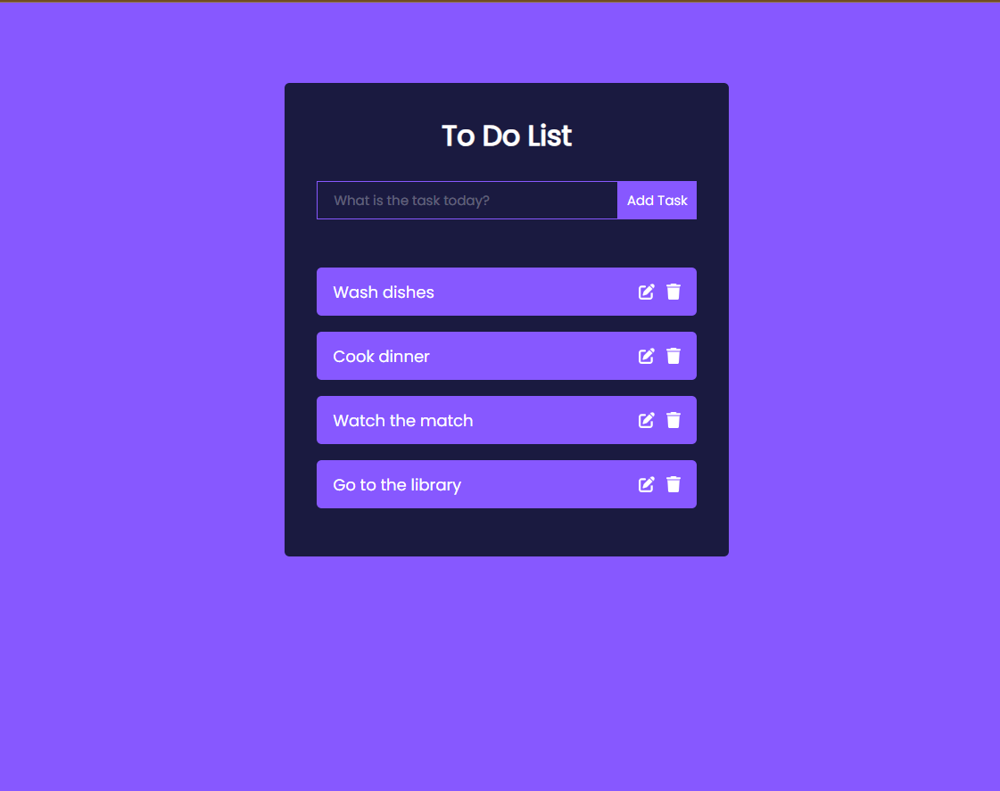

# Beginner's React To-Do List

Welcome to my beginner's React to-do list project! This is a simple to-do list application built using React. If you're new to React, this project is a great way to get started and practice your skills.

## Features

- Add tasks to your to-do list.
- Mark tasks as completed.
- Delete tasks.
- Clean and user-friendly interface.

## Technologies Used

- React: A JavaScript library for building user interfaces.
- JavaScript: The programming language used for the logic.
- CSS: Styles for the application.
- HTML: The structure of the app.

